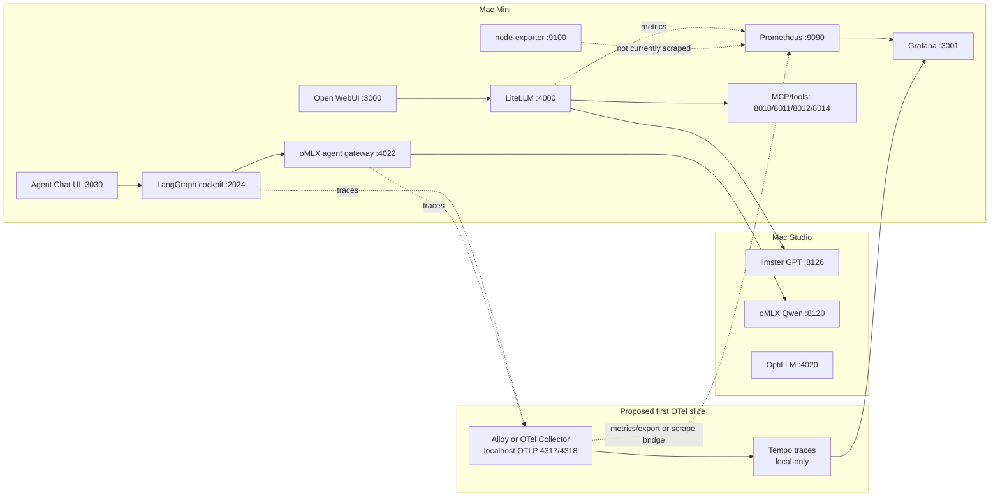

# OpenTelemetry Cockpit Handoff

Date: 2026-05-25

Purpose: give the next project chat enough current reality to start an
OpenTelemetry observability slice without rediscovering the homelab topology.

## Executive Read

OpenTelemetry is feasible here and probably worth the effort. The Mini already
has Grafana, Prometheus, node-exporter, LiteLLM Prometheus metrics, LangGraph,
FastAPI sidecars, Dockerized tools, and several service boundaries that need
request correlation more than another bespoke dashboard.

The best first slice is not a big cockpit rewrite. It is:

1. Add one local collector on the Mini, preferably Grafana Alloy or upstream
   OpenTelemetry Collector.
2. Add one trace backend that Grafana can read, most likely local Tempo.
3. Keep Prometheus as the metrics backend for now.
4. Instrument one or two Python services first: `orchestration-cockpit` and
   `omlx-agent-gateway`.
5. Do not touch model serving, LiteLLM routing, public aliases, or LAN exposure
   in the first slice.

## Source Anchors

Local evidence gathered in this pass:

- Repo registry: `platform/registry/services.jsonl`
- Platform docs: `docs/PLATFORM_DOSSIER.md`, `docs/INTEGRATIONS.md`
- Runtime checks:
  - `systemctl list-units --type=service --state=running,failed`
  - `systemctl list-unit-files`
  - `ss -ltnp`
  - Prometheus targets API at `http://127.0.0.1:9090/api/v1/targets`
  - LiteLLM readiness at `http://127.0.0.1:4000/health/readiness`
  - Grafana health at `http://127.0.0.1:3001/api/health`

External references:

- Grafana Alloy is Grafana's OpenTelemetry Collector distribution and can
  collect metrics, logs, traces, and profiles, with Prometheus compatibility:
  <https://grafana.com/docs/alloy/latest/>
- Grafana's OpenTelemetry docs recommend Alloy for production observability
  and show OTLP receivers on `4317`/`4318`:
  <https://grafana.com/docs/opentelemetry/collector/grafana-alloy/>
- Prometheus supports OTLP ingestion in current releases, but it is opt-in:
  <https://prometheus.io/docs/guides/opentelemetry/>
- The installed Prometheus on this Mini is `2.45.3`; `prometheus --help` did
  not show the current `--web.enable-otlp-receiver` flag. Treat direct OTLP
  metrics ingest as upgrade-gated.
- OpenTelemetry Collector uses receivers, processors, exporters, connectors,
  and extensions:
  <https://opentelemetry.io/docs/collector/components/>
- OpenTelemetry has GenAI semantic conventions for LLM calls, tool execution,
  tokens, request models, and response models:
  <https://opentelemetry.io/docs/specs/semconv/gen-ai/gen-ai-spans/>
- LangSmith can consume OpenTelemetry traces and maps GenAI/OpenInference/LLM
  attributes to LangSmith trace fields:
  <https://docs.langchain.com/langsmith/collector-proxy>
- LangSmith's LiteLLM tracing docs warn not to enable duplicate LangSmith
  tracing paths for the same LiteLLM calls:
  <https://docs.langchain.com/langsmith/trace-litellm>

## Current Observability Stack

Installed packages on the Mini:

| Component | Current reality |
| --- | --- |
| Grafana | `12.3.3`, package-managed, active |
| Prometheus | `2.45.3+ds-2ubuntu0.3`, package-managed, active |
| prometheus-node-exporter | `1.7.0`, active on `*:9100` |
| Grafana Alloy | not installed |
| OpenTelemetry Collector | not installed |
| Tempo | not installed |
| Loki / Promtail | not installed |
| Pyroscope | not installed |

Grafana:

- Runtime URL: `http://127.0.0.1:3001`
- Tailnet operator URL: `https://grafana.tailfd1400.ts.net/`
- Health returned `database: ok`, version `12.3.3`.
- Runtime config at `/etc/homelab-llm/grafana/grafana.ini` is minimal:
  server bind plus provisioning path.
- Provisioned datasource: Prometheus at `http://127.0.0.1:9090`.
- Existing dashboard folder: LiteLLM.

Prometheus:

- Health endpoints returned ready and healthy.
- Current runtime config:
  `/etc/homelab-llm/prometheus/prometheus.yml`
- Current target set from API:
  only `job=litellm`, `instance=127.0.0.1:4000`, `scrapeUrl=/metrics/`, `up`.
- Important drift: repo docs describe Prometheus as localhost-only, but
  `/etc/default/prometheus` currently sets
  `--web.listen-address=0.0.0.0:9090`.
- Node-exporter is running and serving metrics on `*:9100`, but Prometheus is
  not currently scraping it.

LiteLLM:

- Runtime: `litellm-orch.service`, active.
- Version from readiness: `1.83.4`.
- Prometheus callback is active as `PrometheusLogger`.
- `/metrics/` is open and includes request, failure, latency, TTFT, token, and
  process/Python metric families.
- Existing metric labels already carry useful dimensions such as
  `requested_model`, `route`, `status_code`, `client_ip`, and `user_agent`.

## Active Mini Services Relevant To OTel

This table is current runtime reality from `systemctl`, `ss`, health probes,
and repo docs. It is not a full platform inventory.

| Service | State | Endpoint / port | OTel relevance |
| --- | --- | --- | --- |
| `litellm-orch` | active | `0.0.0.0:4000` | Gateway metrics already exist; trace spans around routing/upstream calls would be high-value. |
| `prometheus` | active | actual `0.0.0.0:9090` | Existing metrics store; keep for first slice. |
| `grafana-server` | active | `127.0.0.1:3001` | Existing UI for dashboards; add Tempo datasource later. |
| `prometheus-node-exporter` | active | `*:9100` | Immediate low-risk scrape candidate. |
| `orchestration-cockpit-graph` | active | `127.0.0.1:2024` | Best first app trace target; LangGraph + Pi/Qwen runs need span-level debugging. |
| `orchestration-cockpit-ui` | active | `127.0.0.1:3030` | UI health/logs useful; deeper frontend tracing can wait. |
| `omlx-agent-gateway` | active | `127.0.0.1:4022` | Best second app trace target; bridges Mini agent workflows to Studio oMLX. |
| `open-webui` | active | `0.0.0.0:3000` | Human UI; useful later via HTTP/log correlation, but avoid first-slice patching. |
| `openhands` | active | `127.0.0.1:4031`, tailnet via `svc:hands` | Agent UI; trace correlation useful later, but container internals make it a second wave. |
| `opencode-web` | active | `0.0.0.0:4096` | Coding UI; useful for higher-level request logs and model-call correlation. |
| `ccproxy-api` | active | `127.0.0.1:4010` | Codex sidecar behind `chatgpt-5`; useful later for spans/errors. |
| `media-fetch-mcp` | active | `127.0.0.1:8012` | Tool-service traces can explain retrieval latency/failures. |
| `youtube-transcript-api` | active | `127.0.0.1:8014` | FastAPI service; easy instrumentation candidate after cockpit/gateway. |
| `open-terminal-mcp` | active | `127.0.0.1:8011` | Tool service; trace/log correlation useful, but keep read-only boundary. |
| `open-terminal` | active container | `127.0.0.1:8010` | Tool UI/backend; later container observability candidate. |
| `searxng` | active | `127.0.0.1:8888` | Search latency/failure metrics useful; scrape/export path depends on SearXNG config. |
| `postgresql@16-main` | active | `127.0.0.1:5432` | LiteLLM DB-backed auth; DB metrics useful later via exporter. |
| Docker | active | local daemon | Container metrics/logs candidate via cAdvisor or collector Docker receiver. |

## Inactive Or Broken But Not Retired

These should be recorded before any OTel project assumes service absence means
retirement.

| Service | Current state | Notes |
| --- | --- | --- |
| `qwen-agent-proxy` | inactive, disabled | Repo still has the experiment; not active runtime. Do not include in first OTel scope. |
| `ov-server` | enabled but crash-looping | Fails with `status=203/EXEC`; unit points at stale `layer-inference/ov-llm-server/.venv/...`. OpenVINO is supported in docs but not currently healthy. |
| `openhands-compat-proxy` | enabled but crash-looping | Fails because unit points to stale worktree path `homelab-llm-qwen-agent-boring-baseline-20260418/.../compat_proxy.py`. |
| node-exporter collector timers | installed; helper services inactive between timer runs | Normal for textfile collector helpers. Main `prometheus-node-exporter.service` is active. |
| `tiny-agents` | supported in registry, no active unit observed | Candidate later, not current runtime. |
| `content-extract` | supported in registry, no active unit observed in Mini checks | Candidate later if brought into agent/eval workflows. |

## Studio Runtime Touchpoints

Reachability from the Mini during this pass:

| Service | Current evidence | OTel relevance |
| --- | --- | --- |
| Studio `8126` llmster GPT | `/v1/models` returned GPT-OSS 20B/120B and embedding IDs | Primary model backend for `fast`, `deep`, `task-*`; request correlation from LiteLLM to Studio would be valuable. |
| Studio `8120` oMLX Qwen | direct `/v1/models` returned `401` without token | Expected protected runtime; Mini sidecar `4022` is healthy and is the easier first instrumentation point. |
| Studio `4020` OptiLLM proxy | `/v1/models` returned LiteLLM-style aliases | Deployed but not active public alias surface; observe later if used. |

Do not mutate Studio launchd or model serving in the first OTel slice. If
Studio host metrics/traces are needed later, run a collector on Studio as a
separate, explicit host-scope slice.

## Topology



## Why OTel Fits This Stack

OpenTelemetry solves the missing layer between existing metrics and agent
debuggability:

- Metrics already answer "is LiteLLM slow or failing by model?"
- Traces would answer "which cockpit run called which sidecar, which upstream,
  which tool, and where did latency/error occur?"
- Logs can later be correlated by `trace_id` without rewriting every service.
- The GenAI semantic conventions give a shared vocabulary for LLM request
  model, response model, token usage, tool calls, and retrieval spans.
- LangSmith can still receive OTel traces later without making LangSmith the
  only telemetry path.

## Candidate Integration Points

Best first targets:

| Target | Why first | Suggested signal |
| --- | --- | --- |
| `orchestration-cockpit` | It is the emerging LangGraph control surface and already creates local run ledgers. | Trace each graph run, route decision, Pi launch, sidecar call, and error. |
| `omlx-agent-gateway` | It is a small FastAPI bridge with clear upstream calls to Studio. | FastAPI server spans, HTTP client spans, model id, status, latency, error class. |
| Prometheus scrape config | Current scrape set is too small. | Add node-exporter and Prometheus self-scrape before adding complex app metrics. |

Good second wave:

| Target | Reason |
| --- | --- |
| `youtube-transcript-api` | Small FastAPI utility; easy low-risk pattern repetition. |
| `media-fetch-mcp` | Tool spans will matter for agent workflows and retrieval debugging. |
| LiteLLM | Already has metrics; trace callbacks are useful but risk duplicate traces if paired with LangSmith or app-level tracing. Plan carefully. |
| Docker/container metrics | OpenHands and Open Terminal are containerized; container metrics help explain resource pressure. |
| Studio collector | Needed for host/model-runtime metrics, but should be separate from Mini first slice. |

Avoid first:

- Open WebUI internals.
- OpenHands internals.
- LiteLLM custom callback refactors.
- Any new public route.
- Any model-serving change.

## Collector / Backend Options

Recommended local path:

- Collector: Grafana Alloy on the Mini.
- Metrics backend: existing Prometheus.
- Trace backend: local Tempo.
- Visualization: existing Grafana.

Why Alloy:

- It is designed as an OTel Collector distribution with Prometheus pipelines.
- It can receive OTLP from apps, scrape Prometheus endpoints, enrich labels, and
  export to multiple backends later.
- It gives a path to logs/traces/metrics without replacing Prometheus on day
  one.

Alternative:

- Upstream `otelcol-contrib` instead of Alloy.
- This is fine if simpler to package, but Grafana docs and the existing Grafana
  stack make Alloy the more natural fit.

Not recommended as first move:

- Push OTLP metrics directly into current Prometheus. Installed Prometheus
  `2.45.3` does not advertise the current OTLP receiver flag in `--help`.
- Self-host Langfuse as the first local trace backend. It may still be useful
  for LLM evals later, but Grafana+Tempo is a better fit for cohesive system
  observability.
- LangSmith-only tracing. Useful and likely easy for LangGraph, but it does not
  use the Grafana/Prometheus investment as directly.

## First Implementation Slice Proposal

Goal: prove local trace flow end-to-end without touching model serving.

Scope:

- Add repo-managed `services/opentelemetry-cockpit` or
  `services/observability-otel` only if the repo wants a canonical service
  boundary. Otherwise start with `services/grafana` and `services/prometheus`
  docs/config only after reading their service docs.
- Install/run a Mini-local collector on localhost-only OTLP:
  - OTLP gRPC: `127.0.0.1:4317`
  - OTLP HTTP: `127.0.0.1:4318`
- Install/run local Tempo on localhost-only.
- Provision Grafana Tempo datasource.
- Keep Prometheus as-is initially, then add:
  - Prometheus self-scrape
  - node-exporter scrape
  - collector self-metrics scrape
- Instrument `orchestration-cockpit` with OTel env/config and minimal spans.
- Instrument `omlx-agent-gateway` with FastAPI and HTTPX instrumentation.
- Add a single trace correlation field to existing local ledgers where useful:
  `trace_id`.

Acceptance:

- Grafana can show at least one cockpit trace through Tempo.
- A `/pi` or ordinary cockpit request creates correlated spans.
- oMLX gateway spans show Mini request, upstream Studio request, status, and
  latency.
- Prometheus still scrapes LiteLLM.
- No model aliases, model backends, LiteLLM routes, Open WebUI settings, or
  public exposure changed.

## Guardrails For The Next Chat

- Start in a linked worktree; primary worktree is baseline-only.
- Read service docs before touching `grafana`, `prometheus`,
  `orchestration-cockpit`, `omlx-agent-gateway`, or `litellm-orch`.
- Do not commit secrets or telemetry API keys.
- Keep all new OTel/Tempo/collector endpoints localhost-only unless explicitly
  approved.
- Treat current Prometheus `0.0.0.0:9090` bind as drift to discuss, not as
  permission to add more LAN exposure.
- Do not restart or mutate model-serving services for the first trace slice.
- If adding LangSmith export later, avoid duplicate traces from both
  LangChain/LangGraph tracing and LiteLLM `langsmith` callback on the same
  request path.

## Suggested New Chat Prompt

Use this to start the project:

```text
We are starting the OpenTelemetry cockpit slice in /home/christopherbailey/homelab-llm.
Read AGENTS.md and docs/journal/2026-05-25-opentelemetry-cockpit-handoff.md first.
Goal: implement the smallest local-only OpenTelemetry path that lets Grafana show traces for orchestration-cockpit -> omlx-agent-gateway -> Studio oMLX calls, while preserving existing Prometheus/LiteLLM metrics.
Do not change model serving, LiteLLM aliases, Open WebUI, OpenHands, or public exposure.
Use a linked worktree, ask planning questions until decision complete, then implement only the accepted first slice.
```

## Open Questions For Planning

- Should the repo create a new canonical service boundary for the collector and
  Tempo, or keep this under existing `grafana` / `prometheus` observability
  services?
- Is local Tempo acceptable as the trace backend, or should the first slice send
  traces only to LangSmith OTel while Grafana/Tempo is prepared later?
- Should the first pass fix Prometheus bind drift back to localhost-only, or
  leave bind cleanup as a separate risk-reduction slice?
- Should node-exporter scraping be added in the same slice as tracing, or kept
  as a tiny follow-up metrics slice?
- Should trace payloads include LLM prompt/output content by default, or should
  the first slice redact message bodies and record only model, route, status,
  token counts, and artifact paths?
